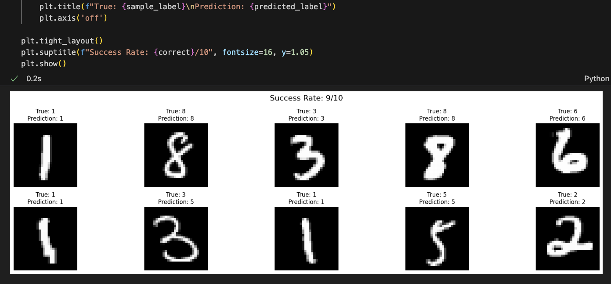

## MNIST digit classifier, numpy only and trained from scratch

Fully hand built neural network for recognizing handwritten digits from MNIST dataset.

Manually implemented: forward propagation, relu softmax activation functions, cross entropy loss, backward propagation, gradient descent

The model was trained from scratch using only matrix operations. No autograd, no optimizers pure fundamentals.

Simple 3 layer architecture:

input layer: 784 neurons (flattened 28x28 images)
hidden layer: 128 neurons
output layer: 10 neurons

training was done over 300 epochs, achieving 90% train and test accuracy.

